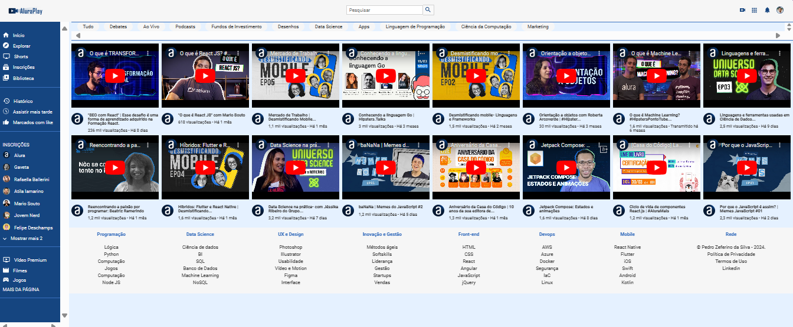

    <h1>AluraPlay - 2024.</h1>

## Este é o repositório base do nosso projeto de estudo, nele voce encontrará uma página  HTML simples e um arquivo CSS.

- Onde você pode  ver o projeto: [aqui](pedrozef.github.io/aluraplay-2024/)

## Desafio Aluraplay - 2024 sobre videos e sua estelização com:

  

    

  

    
      
    

  

    
    

 

